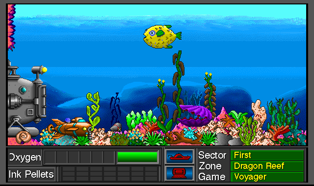
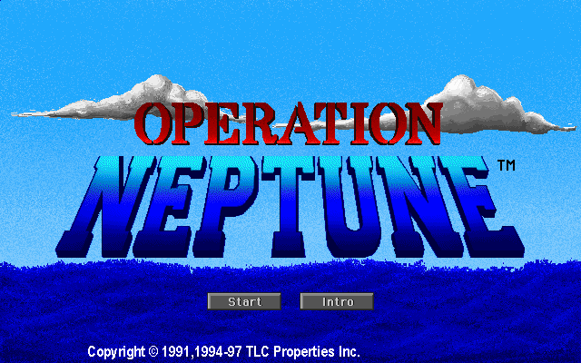
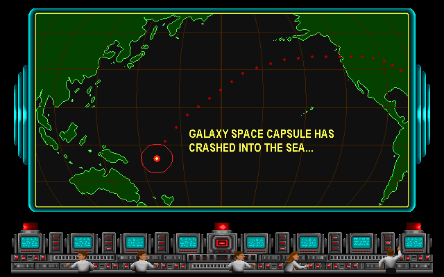
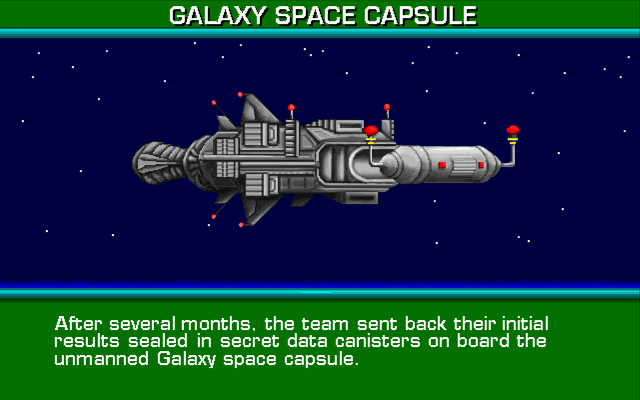
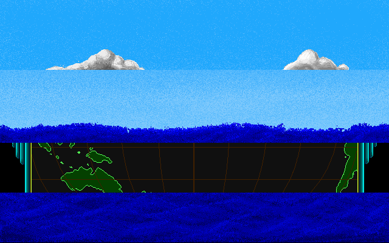
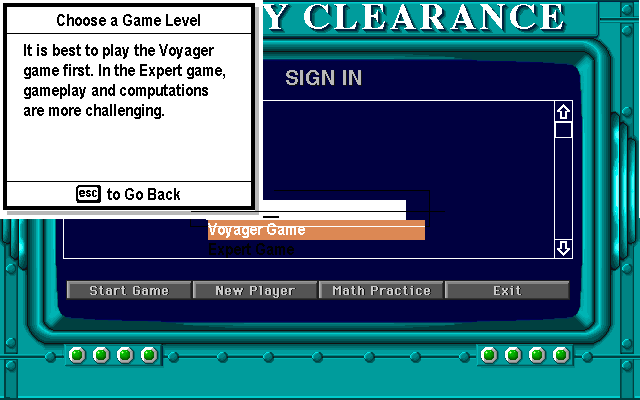
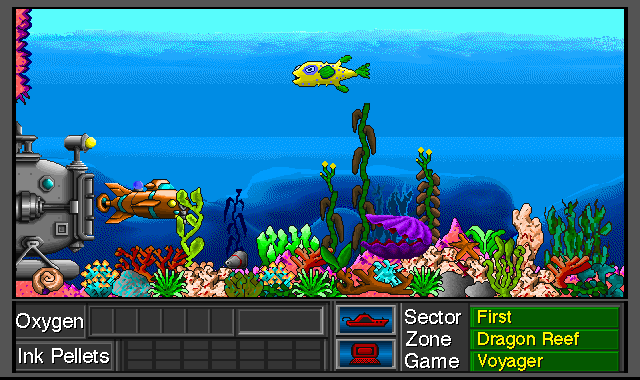

# Operation Neptune Static Recompilation

Static recompilation of **Operation Neptune** (The Learning Company, 1991;
Windows CD re-release 1998) from its shipping Win32 binary to native C.
`ONWIN32.EXE` is an unpacked Borland-compiled PE that holds the whole game —
the submarine, the maths engine, the labyrinth, the puzzles — and this project
lifts every function in it to C and answers the Win32 API it expects with a
small runtime.

No emulator. The 1998 machine code, translated once and compiled for a machine
that did not exist when it shipped.

The CD also shipped `ONWIN.MAP`, the Borland **linker map** for the 16-bit build
of the same source tree. That is 96 named source modules and 1,058 named game
functions, left on the disc by accident.

Built on the [pcrecomp](https://github.com/sp00nznet/pcrecomp) toolchain,
alongside the same-era DOS/Win16 arc of civ (1991), DinoPark Tycoon (1993),
Bolo Adventures III (1993) and El-Fish (1993).

## Status

**It plays.** The recompiled binary runs the Borland CRT startup, reaches
WinMain, passes the game's own environment checks, opens all six of its resource
DLLs by hand, plays the opening with its music and narration, signs a player in,
and puts you in the submarine.



*Sector First, Dragon Reef. The sub, the reef, the fish and the oxygen gauge,
all drawn by Operation Neptune's own code running natively. The arrow keys move
the sub.*

## What it looks like

Every one of these is the recompiled game running.

| | |
|---|---|
|  |  |
| The title screen, with its Start and Intro buttons | Mission control, typed out a letter at a time |
|  |  |
| The briefing: the Galaxy space capsule | Mid-dissolve, the world map wiping through the sea |
|  |  |
| Sign in, and choose a level | Launched, at the mouth of Dragon Reef |

The panel text in the sign-in shots is real GDI — `CreateFontIndirectA` and
`TextOutA` — drawn into the same pixels the game writes its sprites to. The
title and the reef are its own sprite code. Both go through the WinG shim.

## Where it works and where it doesn't

Working:

- **The intro runs** end to end — the title, the mission-control track, the
  Galaxy capsule briefing — with its MIDI score and its narration.
- **Sound.** `Enept1.mid` and `Enept2.mid` play through MCI; speech and effects
  go out through `waveOut` at 8, 16 and 22 kHz.
- **Input.** Mouse and keyboard reach the game's own window procedure, so the
  menus click, names type, and the sub moves.
- **The player roster.** New player, name entry, level choice, and the game
  starts in the right zone at the right difficulty.
- **Graphics are correct**, sprites and GDI text alike, at 640×400 in 256
  colours.

Not working yet:

- **Dialogs are stubbed.** `DialogBoxParamA` takes a dialog procedure that lives
  in lifted code; the window procedure already makes that round trip, so this is
  the same trick again. Nothing on the path above has needed one.
- **Nothing is named.** 1,205 functions are still `sub_0041xxxx` while
  `ONWIN.MAP` sits there with 1,058 names in it. See [Next](#next).
- **No mission has been finished.** The sub moves and the reef is there; the
  maths problems, the foes and the capsule pieces are all still unvisited.

The lift itself:

| | |
|---|---:|
| Functions recovered | 1,205 (143 thunks) |
| Instructions decoded | 91,587 |
| Code bytes covered | 175,839 of 176,128 — **99.84%** |
| Lines of generated C | 189,190 |
| Lift errors / unsupported opcodes | 0 / 0 |
| Imports bridged | 139 of 139 |

Zero errors and zero dropped opcodes is not the usual first-pass result. It is
what a small, unpacked, Borland-compiled 32-bit binary with no hand-written
assembly and no DirectX looks like going through `lift32` — plain integer code,
x87 for the maths, and a DIB for the pixels.

## What it draws through

There is not one `BitBlt` in the import table. The game loads **WING32.DLL** at
runtime — Microsoft's 1994 fast-DIB library — and does all of its drawing
through eight entry points: it creates a memory DC, asks WinG for a bitmap, gets
a raw pointer to the pixels, renders into that with its own code, and blits.

Windows has not shipped WinG in decades, so `src/engine/iat_bridge.c` is WinG
now. The buffer it asks for is 640x**800** for a 640x400 screen — two pages,
flipped by blitting from a different `y`.

The catch is that the game draws into that buffer **two ways at once**: sprites
through the raw pointer WinG hands back, and every string through real GDI —
`CreateFontIndirectA`, `SetTextColor`, `TextOutA` — into the WinG DC. So the
pixels cannot just be a buffer of ours. They live in a pagefile-backed section
mapped twice: once by us at a fixed address below 4 GB, for the game, and once
by `CreateDIBSection`, for GDI. Two views, one set of pages. Handing back a
plain buffer got every sprite and lost every string.

Four other things could not simply be passed through to the host:

- **Anything returning a pointer.** `GlobalAlloc`, `GlobalLock` and
  `VirtualAlloc` hand the game an address it keeps in a 32-bit slot, and on a
  64-bit host the real return does not survive the truncation. They come from a
  heap the runtime reserves below 4 GB instead.
- **Callbacks and structs.** The window procedure is a VA with no machine code
  behind it, and `WNDCLASSA`, `MSG` and `PAINTSTRUCT` are laid out differently
  for 32- and 64-bit. Those are translated field by field.
- **Audio, twice over.** `WAVEHDR` is 32 bytes in the game and 48 here, and
  every MCI parameter block leads with a callback that grew from 4 bytes to 8.
  Each is copied field by field into a host-side twin in `src/engine/audio.c`.
  The driver writes back, too, and the loop that plays the narration spins on
  `WHDR_DONE` without ever pumping its message queue — so the device is opened
  with our own callback whatever the game asked for, and that writes the flags
  straight into the game's header.
- **Two checks from 1996.** `CheckSound` opens `C:\WINDOWS\SYSTEM\MIDIMAP.CFG`,
  the Windows 3.1 MIDI mapper config; `CheckDisplay` wants the desktop in
  640×480 at 256 colours. Both are the game's own INI switches, meant to be
  turned off by anyone whose machine did not match — which now means everyone.

Everything else — 100 or so of the 139 imports — is one table of names and
argument counts going straight to the real API. On x64 the caller cleans the
stack, so a single bridge body serves them all.

## Where this came from

This is the second pass at Operation Neptune. The first was
**[OpenGizmos](https://github.com/sp00nznet/OpenGizmos)** — a clean-room
reimplementation of the whole TLC *Super Solvers* / *Treasure* family in C++
with SDL2, which got as far as a multi-game launcher, a working asset viewer and
a Neptune game module.

Clean-room got the *formats*. It could never get the *game*: the maths problem
generator, the foe behaviour, the exact balance of the ballast puzzle, the
sequencing of the opening — all of that is 176 KB of Borland output that nobody
was going to reimplement by observation.

So the formats work carries over intact and the behaviour comes from the binary
instead. Everything in [FORMATS](docs/FORMATS.md) is OpenGizmos' findings;
everything in [RECON](docs/RECON.md) and [SYMBOLS](docs/SYMBOLS.md) is new.

Assets are already solved. `tools/extract_assets.py`, carried over from that
work, pulls the game apart completely:

| | |
|---|---:|
| Sprites (RUND codec, `NEP256.DLL`) | 1,158 |
| WAV (speech and effects) | 488 |
| MIDI | 20 |
| Puzzle / definition resources | 852 |
| Smacker video | 1 |

## What's on the disc

Two builds of the same source ship side by side — `ONWIN.EXE` (NE, 16-bit) and
`ONWIN32.EXE` (PE32). `INSTALL\AUTORUN.INI` names `Onwin32.exe` as the product,
so that is the recomp target. Nothing is packed or copy-protected.

See [RECON](docs/RECON.md) for the full teardown.

## Layout

```
original/       your copy of the retail CD (gitignored — see Legal)
docs/           RECON, SYMBOLS, FORMATS
tools/
  run_pipeline.py    PE analysis -> discovery -> lift -> C
  parse_map.py       ONWIN.MAP -> work/symbols.json
  extract_assets.py  TLC resource extractor (from OpenGizmos)
src/engine/     the runtime: register model, low heap, IAT bridges, WinG
  audio.c            waveOut and MCI, translated for 64-bit
src/recomp/gen/ generated C (regenerated, not committed)
scripts/        build.ps1, shot.ps1
extracted/      extracted assets (regenerated, not committed)
work/           the built exe and scratch analysis output
```

## Building and running

MSVC (any 2022 edition) and Python 3. With your own copy of the CD in
`original/`:

```powershell
python tools\run_pipeline.py original\ONWINCD\ONWIN32.EXE --all `
    --output src\recomp\gen --stubs src\recomp\imports_stub.c
scripts\build.ps1
work\neptune.exe original\ONWINCD\ONWIN32.EXE
```

The lift takes about fifteen minutes; the build, a couple more. Everything else
is seconds.

| Environment variable | |
|---|---|
| `NEP_QUIET_BRIDGES=1` | stop logging every API call |
| `NEP_QUIET_FILES=1` | stop logging every file and INI read |
| `NEP_NO_DIALOGS=1` | answer message boxes instead of blocking on them |
| `NEP_WATCHDOG_MS=10000` | dump a trace and quit after this long |
| `NEP_QUIET_AUDIO=1` | stop logging waveOut and MCI |
| `NEP_SCREEN=w,h` | what to tell the game the desktop is (default 640,480) |
| `NEP_WATCH=0x412a40,…` | report entry to these functions (`build.ps1 -Trace`) |

Any of the `QUIET` switches set to `0` turns that log back on, so a driving
script can default to quiet and still be overridden from outside.

`scripts\shot.ps1` runs the game, drives it, and photographs it. Shots are of
the client area, and the picture is blitted to client (0,0), so a pixel in a
screenshot is a coordinate you can click:

```powershell
# skip the intro at the title screen, sign in as ALEX, pick the Voyager game,
# and take the sub for a swim
scripts\shot.ps1 -At 205,250 -Out work\play.png `
    -Clicks "100@270,331","118@262,290","150@136,290","170@300,229","195@320,200" `
    -Type "128@ALEX" -Keys "215@39x50","240@40x40"
```

The intro takes about a minute and a half to reach the title screen, because the
narration plays at its own speed. The title screen's **Start** button skips the
rest.

Other useful commands:

```bash
# The symbol table the linker left behind
python tools/parse_map.py original/ONWINCD/ONWIN.MAP -o work/symbols.json

# Every sprite, sound and puzzle resource
python tools/extract_assets.py on original extracted/on --all
```

## Next

1. **Name the functions.** The map's addresses are 16-bit `seg:off` and do not
   transfer to the PE. Matching the two builds — by module size, call-graph
   shape and string references — turns 1,058 names into 1,058 named lifted
   functions. This is the highest-value thing left; every trace above would read
   in the game's own vocabulary instead of hex.
2. **Play a mission through.** The sub moves and the reef is drawn; the maths
   problems, the foes, the capsule pieces and the salvage are all still
   unvisited.
3. **Dialogs.** `DialogBoxParamA` needs the same lifted-callback round trip the
   window procedure already does.
4. **Save games.** `ONUSERS.DAT` and `HALLFAME.DAT` load; nothing has written
   one back yet.

## Legal

No game files are included. Operation Neptune is © 1991–1998 The Learning
Company / TLC Properties Inc., and copyright most likely still subsists through
the SoftKey → Mattel → Riverdeep → HMH chain. Bring your own disc.

The code in this repository is MIT licensed. See [LICENSE](LICENSE).
