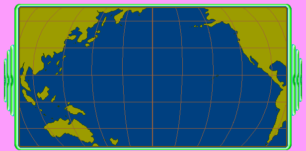

# Asset formats

Operation Neptune keeps nothing in loose files. Every sprite, background, sound
and puzzle sits in a **16-bit NE resource container** — `.DLL` for the ones
Windows loads as modules, `.RSC` for the ones the game opens by hand — and both
are the same format underneath.

None of this was worked out here. It came from the earlier **OpenGizmos**
clean-room effort, which took apart nine TLC/MECC titles from 1990-1998 at once
and used the family resemblance to crack each format. `tools/extract_assets.py`
is that extractor, carried over whole. This document is the Neptune half of what
it learned.

## The containers

| File | What | Resources |
|---|---|---:|
| `ONWINCD\NEP256.DLL` | 256-colour sprites, RUND-compressed | 1,158 |
| `ONWINCD\NEP.DLL` | all the game's text, definitions, room data | 866 |
| `ONWINCD\NEPBG1.DLL`, `NEPBG2.DLL` | backgrounds | 378 |
| `ONWINCD\NE0/1/2SOUND.DLL` | digital speech and effects | — |
| `INSTALL\COMMON.RSC` | shared assets + WAV audio | — |
| `INSTALL\LABRNTH1/2.RSC` | labyrinth tilemaps and tiles | 12 |
| `INSTALL\READER1/2.RSC` | reading-comprehension puzzle art | 19 |
| `INSTALL\SORTER.RSC` | sorting-puzzle sprites and data | 158 |
| `INSTALL\OT3.RSC`, `AUTORUN.RSC` | additional data, autorun shell | 33 |
| `ASSETS\WS*.GRP` | thin WAV wrappers, not real archives | — |
| `ONWINCD\SOUNDS\*.MID` | standard MIDI, no wrapper | 21 |
| `MOVIES\MV107A.SMK` | Smacker video | 1 |

**One gotcha in the NE resource table**: both the offset *and* the length are in
alignment units (512-byte sectors), not bytes. Reading the length as bytes gives
you a 512× truncated resource and a decoder that looks broken.

### Custom resource types

TLC used their own type IDs above the standard `RT_*` range:

| Type | Hex | Holds |
|---|---|---|
| `CUSTOM_15` | `0x800F` | header / animation data |
| `CUSTOM_32513` | `0xFF01` | sprites |
| `CUSTOM_32514` | `0xFF02` | sprite metadata — **and the palette** |
| `CUSTOM_32515` | `0xFF03` | definitions |
| `CUSTOM_32516` | `0xFF04` | room / level data |
| `CUSTOM_32519` | `0xFF07` | WAV audio |

The `.RSC` files break the pattern and use IDs in the `0x79xx` range instead —
`63868`-`63938` for READER, `63968`-`63998` for LABRNTH, `64068`-`64108` for OT3,
`64168`-`64203` for COMMON's audio.

## RUND — the sprite codec

`NEP256.DLL`'s sprites carry a four-byte magic after the dimensions:

```
0x00  u16  width   (little-endian)
0x02  u16  height
0x04  4    "RUND"
0x08  ...  compressed pixel data
```

The compression is byte-oriented RLE with the high bit as the mode flag:

```
byte >= 0x80   run:     repeat the NEXT byte (byte & 0x7F) times
byte <  0x80   literal: copy the next `byte` bytes verbatim
```

Worked example — an 8×4 sprite, 32 pixels:

```
03 C8 27 27    3 literals              ->  3
85 C8          run of 5 x C8           ->  5
84 27          run of 4 x 27           ->  4
84 C8          run of 4 x C8           ->  4
84 27          run of 4 x 27           ->  4
85 C8          run of 5 x C8           ->  5
07 27 27 C8..  7 literals              ->  7
                                          == 32
```

Sprites run from 8×4 to 616×304; typical compression lands between 0.15 and
0.50.

Treasure Mountain! and Treasure Cove! use the same codec, which is how the
run/literal split was confirmed rather than guessed.

## The other RLE — tilemaps and .RSC sprites

The `.RSC` files use a *different*, three-byte-escape RLE:

```
FF XX YY   repeat pixel XX, YY+1 times
00         row terminator (sprite RLE only)
NN         literal pixel
```

Labyrinth and reader backgrounds are full 640×480 screens in this format:

```
0x00  u16  version   (0x0001)
0x02  u16  type      (0x0001)
0x04  u16  flags     (0x0008)
0x06  u16  unknown   (0x000F)
0x08       reserved / zeros
0x20  u32  separator (0xFFFF0000)
0x24  u16  unknown   (0x0004)
0x26  u16  width     (0x0280 = 640)
0x28  u16  height    (0x01E0 = 480)
0x2A  ...  RLE data
```

Tile and object sprites sit alongside them with a simple offset table:

```
0x00  u16  version
0x02  u16  sprite count
0x04  10   flags / reserved
0x0E  4*N  offset table
```

## Palettes, twice over

Two arrangements, depending on the container:

- **`INSTALL\AUTO256.BMP`** — a 602×400 8-bit BMP whose only real job is to
  carry the 256-colour palette at offset `0x36` (256 × 4 bytes, BGRA). This is
  the palette for `NEP256.DLL`.
- **Doubled bytes** — the `.RSC` files store a 1,536-byte resource that is 768
  palette bytes with a zero interleaved: `00 R 00 G 00 B`. Take every other byte
  starting at index 1. Each sprite resource has its own palette in its matching
  `CUSTOM_32514`, and the first 16 entries match the standard VGA palette, which
  is the tell that you have decoded it right.

Index 0 is transparent. The extractor writes it as magenta so it is obvious.

## What comes out

```bash
python tools/extract_assets.py on original extracted/on --all
```

against the retail CD:

| | |
|---|---:|
| Sprites | 1,158 |
| WAV | 488 |
| MIDI | 20 |
| Puzzle / definition resources | 852 |
| Video | 1 |



*Resource 33768, 616x304, RUND-compressed, palette from `AUTO256.BMP` -- the
mission world map, straight out of the container. Magenta is index 0.*

Note the paths in the extractor's game definition assume the **CD** layout,
where the `.RSC` files live under `INSTALL\`. An installed copy moves them next
to the executable.
